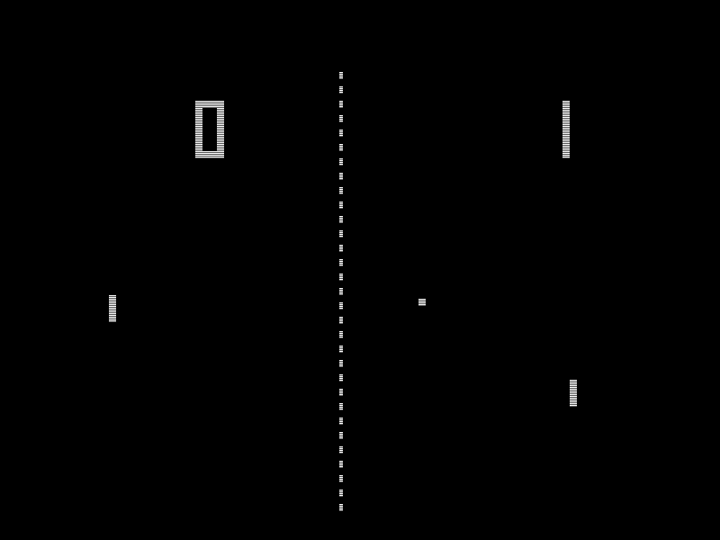

!SLIDE subsection
# How Did We Get Here?

!SLIDE small incremental bullets
# Some history...

* 1996 - Java Applets/Netscape 2.0
* 1999/2000 - XMLHttpRequest (XHR)
* 2003 - Macromedia/Adobe Flash (RTMP Protocol)

!SLIDE center

!SLIDE small incremental bullets
# Comet

* March 2006 - **Comet** - Alex Russell
* event-driven, server-push data streaming
* e.g. in GMail's GTalk interface

!SLIDE small incremental bullets
# Comet

* XHR long-polling / XHR multipart-replace / XHR Streaming
* htmlfile ActiveX Object
* Server-sent events (SSE) - Part of HTML5/W3C

!SLIDE small incremental bullets
# Path to Websockets

* 2007 - TCPConnection API and protocol (Ian Hickson)
* WebSocket - First public draft January 2008

!SLIDE small bullets
# IETF Standardization
## (Network Working Group)

* 2009-Jan - hixie-00
* 2010-Feb - hixie-75 - Chrome 4
* 2010-May - hixie-76 - Disabled in FF/Opera 

!SLIDE small bullets
# IETF Standardization
## (HyBi Working Group)

* 2010-May - hybi-00 - Same as hixie-76
* 2011-April - hybi-07 - Firefox 6
* 2011-Dec - **RFC6455**

!SLIDE small incremental bullets
# Websocket Protocol Details

* TCP-based protocol
* HTTP used solely for upgrade request (Status Code *101*)
* Bi-directional, full-duplex
* Data Frames can be **Text** (UTF-8) or arbitrary **Binary** data

!SLIDE center 
# Websocket Control Frames

!SLIDE small incremental bullets
# Websocket Control Frames

* Communicate state about the WebSocket

* Close (0x8)
* Ping (0x9)
* Pong (0xA)

* More possible in future
* 125 bytes or less

!SLIDE small incremental bullets
# Close Frame

* Terminates WebSocket connection
* Can contain a body (UTF-8 encoded)
* Defines a set of Status Codes, e.g:
* 1000 = normal closore
* 1001 = endpoint is "going away"

!SLIDE small incremental bullets
# Ping + Pong Frame

* Serves as keepalive (Ping followed by Pong)
* Check whether the remote endpoint is still responsive
* Can be sent at any time (Websocket established, before close)
* Just Pongs (unsolicited) = unidirectional heartbeat

!SLIDE small incremental bullets**
# Extensions

!SLIDE small incremental bullets
# Sub-Protocols

!SLIDE small bullets

# HTML5 WebSockets = 
# W3C API + IETF Protocol

!SLIDE small bullets
# RFC 6455 - The WebSocket Protocol
* Final Version: Dec 2011
* http://tools.ietf.org/html/rfc6455

!SLIDE small bullets
# RFC 6455 - WebSocket Schemes

* Unencrypted: ws://
* Encrypted: wss://
* Use encrypted scheme

!SLIDE small bullets
# Upgrade
* ?

!SLIDE small bullets
# RFC 6455 - The WebSocket Protocol
## [http://www.iana.org/assignments/websocket/websocket.xml](http://www.iana.org/assignments/websocket/websocket.xml)

!SLIDE small bullets
# Multiplexing Extension (MUX) for WebSockets
* [http://tools.ietf.org/html/draft-ietf-hybi-websocket-multiplexing-08](http://tools.ietf.org/html/draft-ietf-hybi-websocket-multiplexing-08)
* separate logical connections over underlying transport connection

!SLIDE small bullets
# The WebSocket API
* W3C Candidate Recommendation 20 Sep 2012
* http://www.w3.org/TR/websockets/

* Browser client-side API
* No support for ping/pong frames

!SLIDE small incremental bullets
# The *readyState* attribute
* CONNECTING (0) - Connection not yet established
* OPEN (1) - Connection is established + communication possible
* CLOSING (2) - Connection going through closing handshake / close() method called
* CLOSED (3) - Connection is closed / could not be opened

!SLIDE small incremental bullets
# Event Handlers
* onopen
* onmessage
* onerror
* onclose

!SLIDE
# Code Sample

    @@@ java
    var socket = new WebSocket(
      'ws://localhost:8080/bitcoin-java-servlet/tomcat');
    ...
    socket.onmessage = function(event) {
          console.log(event.data);
          var trade = JSON.parse(event.data);
          trade.date = trade.date * 1000;
          trades.push(trade);
        };
    ...
