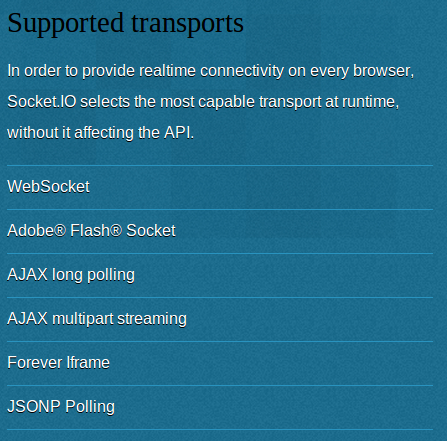

!SLIDE subsection
# Non-Java Solutions

!SLIDE incremental bullets
# Node.js
* <a href="https://npmjs.org/package/websocket">`websocket` package</a>
* <a href="http://socket.io/">Socket.IO</a>
* <a href="http://sockjs.org">SockJS</a>
  
!SLIDE incremental bullets
# More Than Just WebSockets
* XHR streaming
* XHR long polling
* Hidden iframe
* Flash socket
* Polling

!SLIDE center
# Socket.IO

!SLIDE center
# SockJS Transports

!SLIDE bullets incremental
# Socket.IO vs SockJS
* `Socket.IO` more popular
* `SockJS` focused on transports, horizontal scalability
* <a href="https://groups.google.com/forum/#!topic/sockjs/lgzxVnlth54/discussion">Discussion thread</a>

