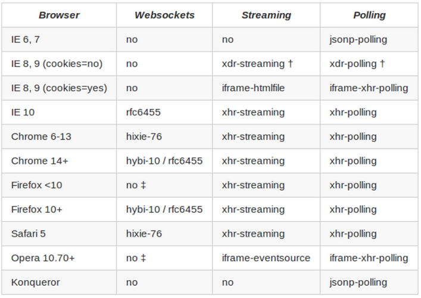

!SLIDE subsection
# Non-Java Solutions

!SLIDE small incremental bullets
# Node.js
* <a href="https://npmjs.org/package/websocket">`Websocket` plugin</a>
* <a href="http://socket.io/">socket.io</a>
* <a href="http://sockjs.org">sockJS</a>

!SLIDE small
# More Than Just WebSocket

!SLIDE small center
# SockJS Transports

!SLIDE small bullets incremental
# socket.io vs sockJS
* `socket.io` more popular
* `sockJS` focused on transports, horizontal scalability
* <a href="https://groups.google.com/forum/#!topic/sockjs/lgzxVnlth54/discussion">Discussion thread</a>

!SLIDE small bullets incremental
# Ruby
* <a href="https://github.com/igrigorik/em-websocket">EM-WebScoket</a>
* _socket.io-rack_
* _sockJS-ruby_

